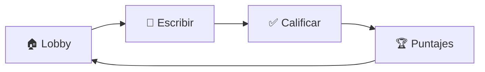

# 🎮 ¡BASTA! - Juego Multijugador Local

<div align="center">


**El clásico juego de palabras mexicano, ahora multijugador en tu navegador**

</div>

---

## 📖 ¿Qué es Basta?

**¡Basta!** (también conocido como *Stop*, *Tutti Frutti* o *Scattergories*) es un juego de palabras clásico donde los jugadores deben escribir palabras que comiencen con una letra aleatoria en diferentes categorías (Nombre, Apellido, Ciudad, Animal, etc.). El primer jugador que complete todas las categorías grita "¡BASTA!" y todos deben dejar de escribir.

Esta versión digital permite jugar en red local con amigos y familia desde cualquier dispositivo con navegador web.

---

## ✨ Características

| Característica | Descripción |
|----------------|-------------|
| 🌐 **Multijugador Local** | Juega con amigos en la misma red WiFi |
| 📱 **Responsivo** | Funciona en móviles, tablets y computadoras |
| 📷 **Código QR** | Únete escaneando un QR desde tu dispositivo |
| 👑 **Sistema de Host Rotativo** | El host rota cada ronda |
| ⚙️ **Categorías Personalizables** | Modifica las categorías y tiempo de cuenta regresiva |
| 🔊 **Efectos de Sonido** | Alertas sonoras para una experiencia inmersiva |
| 🔁 **Reconexión Automática** | Tu puntaje se guarda si te desconectas |
| ⚡ **Tiempo Real** | Comunicación instantánea vía WebSockets |

---

## 🎯 Cómo Jugar

### Flujo del Juego



1. **Lobby**: Los jugadores se unen y marcan "Listo"
2. **Escribir**: Se revela una letra y todos escriben palabras
3. **Calificar**: El host revisa y puede invalidar respuestas
4. **Puntajes**: Se muestran los resultados de la ronda

### Sistema de Puntuación

| Situación | Puntos |
|-----------|--------|
| Palabra única | 100 pts |
| Palabra repetida (2 jugadores) | 50 pts c/u |
| Palabra repetida (N jugadores) | 100/N pts c/u |
| Sin respuesta o letra incorrecta | 0 pts |

---

## 🚀 Instalación

### Requisitos Previos

- Python 3.8+
- pip

### Pasos

```bash
# 1. Clonar el repositorio
git clone <tu-repositorio>
cd stop

# 2. Crear entorno virtual (recomendado)
python -m venv venv
source venv/bin/activate  # Linux/Mac
# o
venv\Scripts\activate     # Windows

# 3. Instalar dependencias
pip install flask flask-socketio eventlet

# 4. (Opcional) Para mostrar QR en terminal
pip install qrcode
```

---

## ▶️ Uso

### Iniciar el Servidor

```bash
python app.py
```

### Conectarse al Juego

Verás un mensaje como este en la terminal:

```
 --- JUEGO LISTO ---
 Escanea para entrar o escribe: http://192.168.1.100:5000
 -------------------
```

**Opciones para unirse:**
- 📷 **Escanear QR** mostrado en la terminal
- 🔗 **Ingresar URL** en el navegador
- 💻 **Host local**: `http://localhost:5000`

---

## 🎮 Controles del Juego

### Lobby
- **"¡ESTOY LISTO!"** - Marca tu disponibilidad
- **Host**: Puede modificar categorías y tiempo de cuenta regresiva
- **Host**: Inicia la ronda cuando todos estén listos

### Durante la Ronda
- Escribe palabras que empiecen con la letra mostrada
- Presiona **¡BASTA!** cuando termines

### Fase de Calificación (Solo Host)
- **✕** - Invalidar una respuesta
- **↺** - Restaurar una respuesta invalidada
- **CONFIRMAR PUNTAJES** - Finalizar la ronda

---

## ⚙️ Configuración

El host puede personalizar el juego desde el panel de ajustes:

| Opción | Descripción | Por Defecto |
|--------|-------------|-------------|
| **Categorías** | Lista de categorías separadas por coma | Nombre, Apellido, Ciudad/País, Flor/Fruto, Animal, Cosa, Color |
| **Cuenta Regresiva** | Segundos después del "¡BASTA!" | 10 segundos |

---

## 🏗️ Arquitectura

```
stop/
├── app.py              # Servidor Flask + Socket.IO
├── templates/
│   └── index.html      # Frontend (HTML + TailwindCSS + JS)
└── README.md
```

### Stack Tecnológico

- **Backend**: Flask + Flask-SocketIO + Eventlet
- **Frontend**: HTML5 + TailwindCSS + JavaScript
- **Comunicación**: WebSockets (Socket.IO)
- **Extras**: QR Code generation, Web Speech API

---

## 🔧 Dependencias

```txt
flask
flask-socketio
eventlet
qrcode  # opcional, para QR en terminal
```

---

## 🎨 Capturas

El juego cuenta con:
- 🌙 Tema oscuro moderno con efectos glassmorphism
- 💫 Animaciones suaves y transiciones
- 📱 Diseño adaptativo para todos los dispositivos
- 🎵 Efectos de sonido inmersivos

---

## 🤝 Contribuir

Las contribuciones son bienvenidas. Algunas ideas para mejorar:

- [ ] Agregar más modos de juego
- [ ] Historial de partidas
- [ ] Diccionario integrado para validación automática
- [ ] Soporte para múltiples idiomas
- [ ] Temas personalizables

---

## 📜 Licencia

Este proyecto está bajo la Licencia MIT.

---

<div align="center">

**Hecho con ❤️ para las noches de juegos en familia**

*¿Encontraste un bug? ¡Abre un issue!*

</div>
